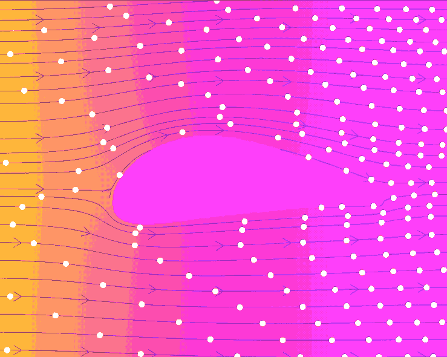
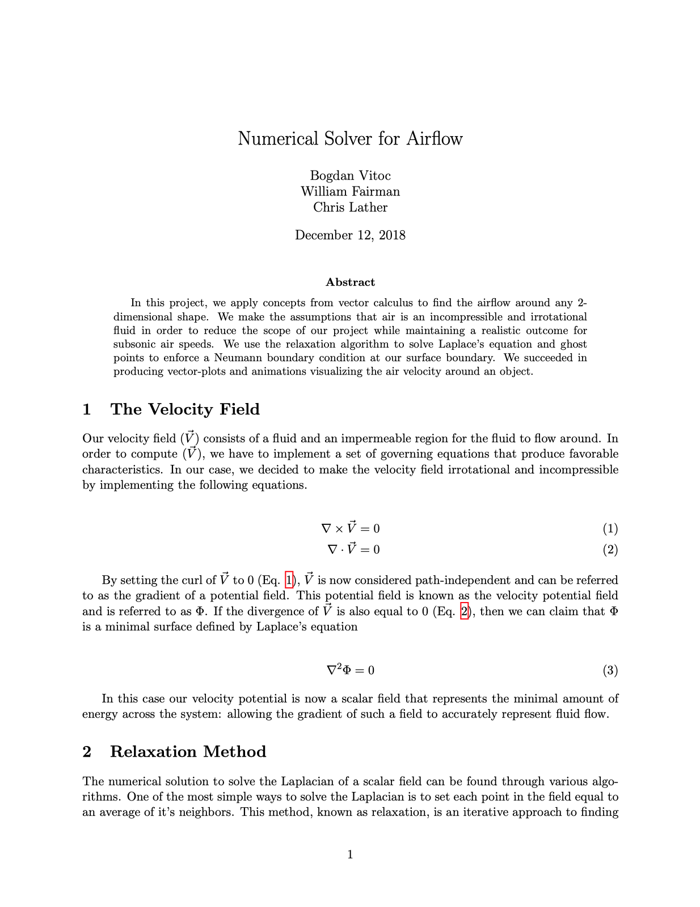

# Numerical Solver for Airflow
- **Bogdan Vitoc, Christopher Lather, William Fairman**
- **December 11th, 2018**
- **Homepage: https://github.com/Bogidon/numerical-solver-for-airflow**

## Abstract
In this project, we apply concepts from vector calculus to find the airflow around any 2-dimensional shape. We make the assumptions that air is an incompressible and irrotational fluid in order to reduce the scope of our project while maintaining a realistic outcome for subsonic air speeds. We use the relaxation algorithm to solve Laplace's equation and ghost points to enforce a Neumann boundary condition at our surface boundary. We succeeded in producing vector-plots and animations visualizing the air velocity around an object.

## Results
|||
|-|-|
 | 

## [Read the report](./report.pdf)
